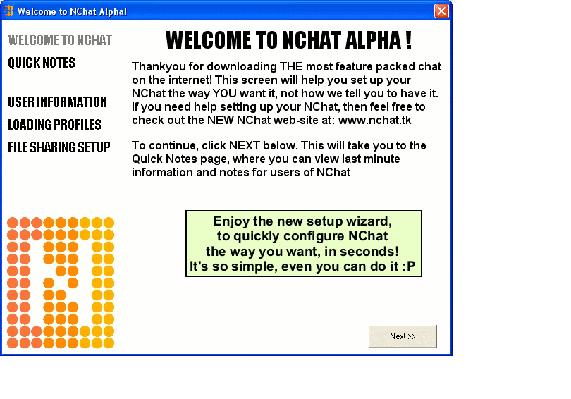



## A \[ NChat Alpha \- Update \] \*AWARD WINNING CODE\* See screenshot

### Description

This is a BETA version of NChat. It's not 100% complete, but it works mostly :P. NChat is a serverless chat application for use on a home / school / office network. It's been 4 years in the making, as a 'I'm bored' project. It's won an award on a1vbcode.com, and is critically acclaimed by numerous web-sites and individuals. It boasts many, many features, including AI, HTML 'schemes', NO servers needed over a network, animated emoticons, VBScript support, earn rewards by chatting, create your own emote packs, plus HEAPS more. You need to see the screenshot to get the full picture. This is a re-upload of a previous entry, coz the download link didn't work, and was outta date anyways. NOTE: THIS IS A BETA VERSION. NO PLANNED UPDATES ARE INTENDED FOR THIS PROJECT. CHECK OUT THE **NEW** NCHAT AT WWW.SOLIDINC.TK. Comments are appreciated, and votes if your generous. Support open-source software!
 
### More Info
 
This code is incomplete. DO NOT rely on it for secure areas etc. It's designed as a learning tool. DO NOT report bugs, as this project is discontinued for now. www.solidinc.tk for the NEW NChat!

             |
---                |---
**Submitted On**   |2005-08-12 17:49:28
**By**             |[Grayda](https://github.com/Planet-Source-Code/PSCIndex/blob/master/ByAuthor/grayda.md)
**Level**          |Advanced
**User Rating**    |5.0 (35 globes from 7 users)
**Compatibility**  |VB 5\.0, VB 6\.0
**Category**       |[Internet/ HTML](https://github.com/Planet-Source-Code/PSCIndex/blob/master/ByCategory/internet-html__1-34.md)
**World**          |[Visual Basic](https://github.com/Planet-Source-Code/PSCIndex/blob/master/ByWorld/visual-basic.md)
**Archive File**   |[A\_\[\_NChat\_1924868182005\.zip](https://github.com/Planet-Source-Code/grayda-a-nchat-alpha-update-award-winning-code-see-screenshot__1-62223/archive/master.zip)

